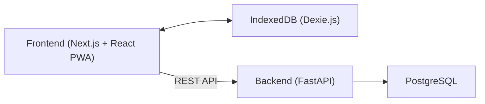

# Aciono Você

> Sistema de Lista Telefônica Hospitalar desenvolvido como uma Progressive Web Application (PWA), com suporte a funcionamento offline, sincronização automática de dados e controle de acesso baseado em papéis (RBAC).


---

## Visão Geral

O **Aciono Você** é um sistema de lista telefônica institucional desenvolvido para o **Hospital das Clínicas da Faculdade de Medicina de Botucatu (HCFMB/UNESP)**.

O projeto foi concebido para funcionar mesmo em ambientes com conectividade limitada, permitindo que profissionais consultem e atualizem contatos enquanto estão offline. Todas as alterações realizadas localmente são sincronizadas automaticamente com o servidor quando a conexão é restabelecida.

Além da consulta de ramais, o sistema oferece autenticação baseada em JWT, controle de permissões por papéis (RBAC), trilha de auditoria das alterações e arquitetura preparada para execução em contêineres Docker.

---

## Principais Funcionalidades

- Consulta de contatos e ramais institucionais.
- Progressive Web Application (PWA).
- Funcionamento Offline (Offline First).
- Sincronização automática entre cliente e servidor.
- Controle de acesso baseado em papéis (RBAC).
- Autenticação utilizando JWT.
- Registro de auditoria das alterações.
- API REST documentada via OpenAPI/Swagger.
- Execução simplificada utilizando Docker Compose.

---

## Arquitetura



O frontend funciona como uma Progressive Web Application (PWA), armazenando dados localmente através do IndexedDB para permitir o funcionamento offline.

Quando a conectividade é restabelecida, as alterações realizadas localmente são sincronizadas automaticamente com a API, que realiza a persistência dos dados no PostgreSQL.

---

## Tecnologias

| Camada | Tecnologias |
|---------|-------------|
| Backend | Python 3.11, FastAPI, SQLAlchemy Async, Alembic, Pydantic |
| Frontend | Next.js 16, React 19, TypeScript, Dexie.js |
| Banco de Dados | PostgreSQL 16 |
| Infraestrutura | Docker, Docker Compose |
| Testes | Pytest |
| Automação | Pytask |
| CI | GitHub Actions |

---

## Estrutura do Projeto

```text
.
├── backend/
├── frontend/
├── scripts/
├── .github/
│   └── workflows/
├── docker-compose.yml
└── README.md
```

Cada diretório possui sua própria documentação detalhando sua arquitetura e processo de desenvolvimento.

- **backend/** → API REST e regras de negócio.
- **frontend/** → Aplicação Web/PWA.
- **scripts/** → Scripts auxiliares para desenvolvimento.
- **.github/** → Pipeline de Integração Contínua.

---

## Contêineres Docker

A aplicação é composta por três serviços.

| Serviço | Porta |
|----------|------:|
| PostgreSQL | 5432 |
| Backend FastAPI | 8085 |
| Frontend Next.js | 8086 |

---

## Como Executar

### Pré-requisitos

- Git
- Docker Desktop
- Docker Compose

### Clonar o projeto

```bash
git clone https://github.com/SEU-USUARIO/aciono-voce.git

cd aciono-voce
```

### Executar

```powershell
.\scripts\deploy-docker.ps1
```

ou

```bash
docker-compose up -d --build
```

Após a inicialização:

| Serviço | Endereço |
|----------|----------|
| Frontend | http://localhost:8086 |
| Backend | http://localhost:8085 |
| Swagger | http://localhost:8085/docs |

---

## Scripts Auxiliares

O projeto possui alguns scripts para facilitar o desenvolvimento.

| Script | Descrição |
|----------|-----------|
| `deploy-docker` | Constrói e inicia todos os contêineres. |
| `rebuild-docker` | Remove os contêineres existentes e realiza uma reconstrução completa sem cache. |
| `test` | Executa lint, testes do backend e validações do frontend. |

---

## Pipeline de Integração Contínua

O projeto utiliza **GitHub Actions** para validação automática em cada **Push** e **Pull Request**.

A pipeline realiza:

- Instalação das dependências.
- Execução do lint do backend.
- Execução dos testes automatizados.
- Execução do lint do frontend.
- Build do frontend.
- Build dos contêineres Docker.
- Inicialização dos serviços.
- Verificação de disponibilidade da aplicação (Health Check).

Caso qualquer etapa falhe, a execução é interrompida.

---

## Branches

Este repositório possui duas linhas de desenvolvimento.

| Branch | Objetivo |
|---------|----------|
| **main** | Versão principal do projeto, utilizada para estudos, evolução da arquitetura e apresentação em portfólio. Utiliza autenticação própria baseada em JWT. |
| **autenticacao-externa** | Variante desenvolvida para integração com um mecanismo de autenticação utilizado em um ambiente corporativo, preservando a arquitetura original na branch principal. |

Essa separação permite manter a versão de portfólio independente das adaptações específicas realizadas para o ambiente corporativo.

---

## Documentação

Cada módulo possui sua própria documentação.

- **Backend:** [`backend/README.md`](backend/README.md)
- **Frontend:** [`frontend/README.md`](frontend/README.md)

---

## Roadmap

Melhorias planejadas para versões futuras:

- [ ] Exportação de contatos.
- [ ] Pesquisa avançada.
- [ ] Dashboard administrativo.
- [ ] Melhorias no processo de sincronização offline.
- [ ] Monitoramento de desempenho da sincronização.

---

## Contribuição

Contribuições são bem-vindas.

Caso deseje colaborar:

1. Faça um Fork do projeto.
2. Crie uma nova branch.
3. Implemente sua alteração.
4. Execute os testes.
5. Abra um Pull Request.

---

## Licença

Este projeto é distribuído sob a licença **MIT**.