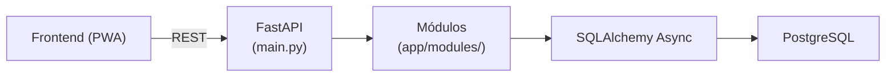

# Backend API

> API REST desenvolvida com **FastAPI** responsável por autenticação, gerenciamento de contatos, sincronização offline, controle de acesso e persistência de dados do sistema **Aciono Você**.


---

# Visão Geral

O backend concentra toda a lógica de negócio da aplicação.

Ele é responsável por autenticar usuários, controlar permissões, persistir dados, processar sincronizações enviadas pelos clientes offline e manter uma trilha de auditoria das alterações realizadas na aplicação.

A API foi desenvolvida utilizando **FastAPI** com programação assíncrona, permitindo maior desempenho durante operações de I/O, como acesso ao banco de dados.

---

# Principais Responsabilidades

- Autenticação utilizando JWT.
- Controle de acesso baseado em papéis (RBAC).
- Gerenciamento de usuários.
- Gerenciamento de contatos.
- Sincronização de dados enviados pelos clientes offline.
- Auditoria das alterações realizadas.
- Persistência de dados utilizando PostgreSQL.
- Exposição da API REST documentada automaticamente pelo OpenAPI.

---

# Arquitetura



A aplicação adota uma organização por **módulos verticais**: cada módulo em `app/modules/` concentra em um único arquivo o modelo ORM, os schemas Pydantic, o repository e o router FastAPI correspondentes. O `core.py` centraliza configuração, banco de dados, segurança e tratamento de erros.

---

# Tecnologias

| Categoria | Tecnologias |
|------------|-------------|
| Linguagem | Python 3.11 |
| Framework | FastAPI |
| ORM | SQLAlchemy 2 (Async) |
| Banco de Dados | PostgreSQL 16 |
| Migrações | Alembic |
| Validação | Pydantic v2 |
| Autenticação | JWT |
| Testes | Pytest |
| Automação | Pytask |

---

# Estrutura do Projeto

```text
backend/
├── app/
│   ├── core.py          # Configuração, banco, segurança e exceções
│   ├── main.py          # Ponto de entrada FastAPI + registro de routers
│   ├── seeds_data.py    # Dados iniciais de seed
│   └── modules/
│       ├── auth.py      # Modelo RefreshToken, schemas, repository, service e router de autenticação
│       ├── contatos.py  # Modelos Contato + AuditTrail, schemas, repositories e router de contatos
│       ├── sync.py      # Schemas, SyncService e router de sincronização offline
│       └── usuarios.py  # Modelo Usuario, schemas, repository e router de usuários
│
├── migrations/          # Migrações Alembic
├── tests/               # Testes automatizados (pytest)
├── pyproject.toml
└── README.md
```

Cada arquivo em `app/modules/` é autossuficiente: reúne modelo ORM, schemas Pydantic, repository e router relativos ao seu domínio.

---

# Banco de Dados

O backend utiliza exclusivamente **PostgreSQL**.

O banco é executado através do Docker Compose juntamente com os demais serviços da aplicação.

As alterações estruturais são controladas utilizando **Alembic**, garantindo versionamento das migrações.

---

# Executando com Docker

Na raiz do projeto execute:

```bash
docker-compose up -d --build
```

Após a inicialização:

| Serviço | Porta |
|----------|------:|
| Backend | 8085 |
| Swagger | http://localhost:8085/docs |
| ReDoc | http://localhost:8085/redoc |

---

# Executando Localmente

Caso deseje executar apenas a API:

## 1. Inicie o PostgreSQL

```bash
docker-compose up -d lista-postgres
```

## 2. Instale as dependências

Utilize exatamente o gerenciador de dependências adotado pelo projeto.

Exemplo:

```bash
poetry install
```

## 3. Execute as migrações

```bash
alembic upgrade head
```

## 4. Inicie a aplicação

```bash
uvicorn app.main:app --reload --port 8085
```

---

# Variáveis de Ambiente

As configurações da aplicação são carregadas através do arquivo `.env`.

Entre elas:

- conexão com PostgreSQL;
- segredo utilizado pelo JWT;
- configurações da aplicação;
- ambiente de execução.

Caso necessário, utilize o arquivo `.env.example` como referência.

---

# Autenticação

A autenticação é baseada em **JSON Web Tokens (JWT)**.

O fluxo é composto por:

1. Login.
2. Emissão do Access Token.
3. Emissão do Refresh Token.
4. Renovação do Access Token.
5. Controle de permissões através de papéis (RBAC).

---

# Sincronização Offline

Uma das principais responsabilidades da API é processar as alterações realizadas pelos clientes enquanto estavam desconectados.

Quando o dispositivo recupera conexão:

1. O frontend envia todas as alterações pendentes.
2. A API valida os dados recebidos.
3. Os registros são persistidos.
4. Conflitos são resolvidos utilizando a estratégia **Last Write Wins**.
5. A resposta retorna ao cliente os registros atualizados.

---

# Auditoria

Toda operação de inclusão, alteração ou remoção gera um registro de auditoria.

Esses registros permitem rastrear:

- usuário responsável;
- operação executada;
- data da alteração;
- informações modificadas.

---

# Testes

Os testes automatizados são executados através do padrão adotado pelo projeto utilizando **Pytask**.

Exemplo:

```bash
poetry run task test
```

Para verificar qualidade do código:

```bash
poetry run task lint
```

---

# Documentação da API

Após iniciar a aplicação:

Swagger

```
http://localhost:8085/docs
```

ReDoc

```
http://localhost:8085/redoc
```

Toda a documentação é gerada automaticamente pelo OpenAPI.

---

# Desenvolvimento

Fluxo recomendado:

1. Criar uma branch.
2. Implementar a funcionalidade.
3. Executar lint.
4. Executar testes.
5. Commit.
6. Push.
7. Abrir Pull Request.

---

# Integração Contínua

O backend participa da pipeline do GitHub Actions.

Em cada Push ou Pull Request são executados:

- instalação das dependências;
- lint;
- testes automatizados;
- build dos containers Docker;
- validação da aplicação.

Caso qualquer etapa falhe, a pipeline é interrompida.

---

# Documentação Relacionada

- README principal → `../README.md`
- Frontend → `../frontend/README.md`