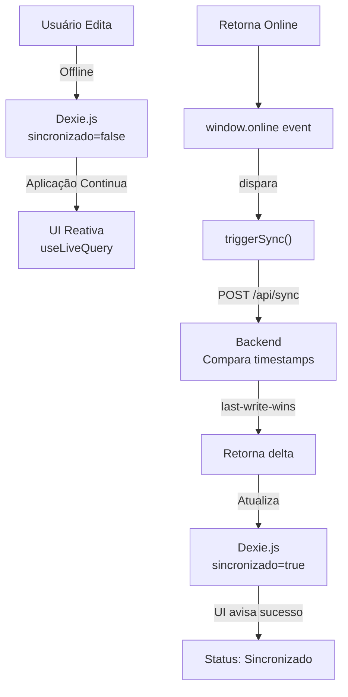

# � Aciono Você — Frontend PWA (Next.js 16 + React 19)

> **Camada de apresentação e persistência offline** do sistema de Lista Telefônica Hospitalar HCFMB · UNESP.

Uma Progressive Web App (PWA) desenvolvido em **Next.js 16** com **React 19**, projetado para funcionar com plena capacidade mesmo **sem conexão de rede**, utilizando **Dexie.js** para gerenciar armazenamento local via **IndexedDB**.

## Índice
- [Iniciando o Desenvolvimento](#-iniciando-o-desenvolvimento)
- [Scripts Disponíveis](#-scripts-disponíveis)
- [Estrutura de Pastas](#-estrutura-de-pastas)
- [Sincronização Offline](#-lógica-de-sincronização-offline)
- [Configuração de Variáveis de Ambiente](#-configuração-de-variáveis-de-ambiente)
- [PWA e Service Worker](#-pwa-e-service-worker)
- [Schema Local (Dexie.js)](#-schema-local-dexiejs--indexeddb)
- [Docker (Produção)](#-docker-produção)
- [Troubleshooting](#-troubleshooting)

---

## 🚀 Iniciando o Desenvolvimento

### Pré-requisitos

- **Node.js** 20.0.0 ou superior
- **npm** 10.0.0 ou superior
- **Backend rodando** em `http://localhost:8085/api` (ou configure `NEXT_PUBLIC_API_URL`)

### Instalação e Execução

```bash
# Instalar dependências
npm install

# Iniciar servidor de desenvolvimento (porta 8086)
npm run dev
```

Acesse **http://localhost:8086** no navegador.

---

## 📁 Scripts Disponíveis

| Script | Descrição | Uso |
|--------|-----------|-----|
| `npm run dev` | Servidor com hot-reload (porta 8086) | Desenvolvimento |
| `npm run build` | Build otimizado para produção | CI/CD, Docker |
| `npm run start` | Serve a build estática de produção | Staging, Produção |
| `npm run lint` | Verifica qualidade com ESLint | QA, Git hooks |
| `npm run type-check` | Verifica tipos TypeScript | CI/CD |

---

## 📂 Estrutura de Pastas

```
frontend/
├── src/
│   ├── app/
│   │   ├── page.tsx              # 📄 Componente principal (SPA single-file)
│   │   │                          #    - Login
│   │   │                          #    - CRUD de contatos
│   │   │                          #    - Sincronização offline
│   │   │                          #    - Status de conexão
│   │   ├── layout.tsx             # Layout raiz com Providers
│   │   └── globals.css            # 🎨 Design System
│   │                              #    - Paleta HCFMB
│   │                              #    - Componentes reutilizáveis
│   │                              #    - Tipografia, espaçamento
│   └── db/
│       └── db.ts                  # 🗄️ Dexie.js Schema
│                                   #    - LocalContato interface
│                                   #    - AcionoVoceDB class
│                                   #    - Índices e queries
├── public/
│   ├── manifest.json              # 📋 Manifest PWA
│   ├── sw.js                       # 🔧 Service Worker
│   └── workbox-7144475a.js         # 📦 Workbox (cache de assets)
├── next.config.ts                 # ⚙️ Configuração Next.js
├── tsconfig.json                  # 📝 Configuração TypeScript
├── package.json
├── eslint.config.mjs
├── postcss.config.mjs
└── README.md                       # Este arquivo
```

---

## 🔄 Lógica de Sincronização Offline

### Ciclo Completo



### Passos Detalhados

1. **Leitura Reativa:** `useLiveQuery()` mantém UI sempre sincronizada com IndexedDB local
   ```typescript
   const contatos = useLiveQuery(
     () => db.contatos.where('excluido').equals(false).toArray(),
     []
   );
   ```

2. **Escrita Offline:** Qualquer criação/edição é persistida localmente:
   ```typescript
   await db.contatos.add({
     id: crypto.randomUUID(),
     nome,
     telefone,
     atualizado_em: new Date().toISOString(),
     sincronizado: false,
     excluido: false
   });
   ```

3. **Detecção de Conectividade:** Listener global dispara sync automaticamente:
   ```typescript
   window.addEventListener('online', () => {
     console.log('Conexão restaurada! Sincronizando...');
     triggerSync();
   });
   ```

4. **Sincronização em Lote:** Coleta todos pendentes:
   ```typescript
   const pendentes = await db.contatos
     .where('sincronizado')
     .equals(false)
     .toArray();

   const payload = pendentes.map(c => ({
     id: c.id,
     atualizado_em: c.atualizado_em,
     excluido: c.excluido
   }));

   const response = await api.post('/contatos/sync', { contatos: payload });
   ```

5. **Resolução de Conflitos (Last-Write-Wins):**
   - Backend compara `cliente.atualizado_em` vs `servidor.atualizado_em`
   - Se **cliente é mais recente** → Aceita mudanças do cliente
   - Se **servidor é mais recente** → Envia versão atualizada de volta

6. **Confirmação Local:** Marca como sincronizado ou remove se deletado:
   ```typescript
   for (const uuid of response.contatos_atualizados) {
     await db.contatos.update(uuid, { sincronizado: true });
   }

   for (const uuid of response.contatos_deletados) {
     await db.contatos.delete(uuid);  // Remove do local
   }
   ```

---

## 🌐 Configuração de Variáveis de Ambiente

### .env.local (Desenvolvimento)

Crie na raiz do projeto:

```env
# API Backend
NEXT_PUBLIC_API_URL=http://localhost:8085/api

# Logging (opcional)
NEXT_PUBLIC_DEBUG=true
```

### Variáveis de Produção (docker-compose.yml)

```yaml
frontend:
  build: ./frontend
  environment:
    NEXT_PUBLIC_API_URL: https://api.hospital.br/lista-telefonica/api
    NEXT_PUBLIC_DEBUG: false
```

**Nota:** Prefixo `NEXT_PUBLIC_` = exposto ao navegador. Usa variáveis do sistema at build time.

---

## 📱 PWA e Service Worker

### O que é PWA?

**Progressive Web App** = aplicação web que se comporta como app nativo:
- ✅ Funciona offline (Service Worker intercepts requests)
- ✅ Installável (manifest.json + ícones)
- ✅ Push notifications (opcional)
- ✅ Acesso a câmera/geolocalização (com permissão)

### Manifest PWA (`public/manifest.json`)

```json
{
  "name": "Aciono Você - Lista Telefônica",
  "short_name": "Aciono Você",
  "description": "Sistema de contatos hospitalares HCFMB · UNESP",
  "start_url": "/",
  "display": "standalone",
  "background_color": "#ffffff",
  "theme_color": "#0066cc",
  "icons": [
    {
      "src": "/icon-192.png",
      "sizes": "192x192",
      "type": "image/png"
    },
    {
      "src": "/icon-512.png",
      "sizes": "512x512",
      "type": "image/png"
    }
  ]
}
```

### Service Worker (`public/sw.js`)

Intercepta requisições e usa cache Workbox:

```javascript
// Gerado automaticamente by Workbox cli
importScripts('/workbox-7144475a.js');

workbox.core.setCacheNameDetails({
  prefix: 'lista-telefonica',
  suffix: 'v1'
});

// Cache de assets estáticos (JS, CSS, fonts)
workbox.precaching.precacheAndRoute(self.__WB_MANIFEST);

// Cache-first para imagens
workbox.routing.registerRoute(
  ({request}) => request.destination === 'image',
  new workbox.strategies.CacheFirst({
    cacheName: 'images'
  })
);

// Network-first para API calls (tenta online primeiro)
workbox.routing.registerRoute(
  ({url}) => url.pathname.startsWith('/api/'),
  new workbox.strategies.NetworkFirst({
    cacheName: 'api-cache',
    plugins: [
      new workbox.expiration.ExpirationPlugin({
        maxEntries: 50,
        maxAgeSeconds: 3600  // 1 hora
      })
    ]
  })
);
```

### Como Instalar a PWA

1. Abra **http://localhost:8086** em navegador moderno (Chrome, Edge, Safari 16.4+)
2. Clique no ícone de "Instalar" (barra do endereço ou menu)
3. Aceite permissões
4. Atalho criado na home/desktop ✅

**Após instalação:**
- Funciona sem internet (exceto API calls não cacheadas)
- Abre em modo fullscreen (sem barra de navegador)
- Ícone e nome conforme manifest.json

---

## 🗄️ Schema Local (Dexie.js / IndexedDB)

### Estrutura TypeScript

```typescript
export interface LocalContato {
  id: string;                           // UUID v4 (crypto.randomUUID())
  nome: string;
  telefone: string;
  email?: string;
  tipo_numero: 'institucional' | 'publico';
  atualizado_em: string;                // ISO 8601 UTC (árbitro de conflitos)
  sincronizado: boolean;                // false = alteração pendente
  excluido: boolean;                    // Soft delete (não remove fisicamente)
}

export class AcionoVoceDB extends Dexie {
  contatos!: Table<LocalContato>;

  constructor() {
    super('AcionoVoceDB');
    this.version(1).stores({
      contatos: '&id, &sincronizado, atualizado_em'
      //        promária, índice boolean, índice datetime
    });
  }
}

export const db = new AcionoVoceDB();
```

### Queries Comuns

```typescript
// Listar não-deletados
const ativos = await db.contatos
  .where('excluido')
  .equals(false)
  .toArray();

// Buscar pendentes de sincronização
const pendentes = await db.contatos
  .where('sincronizado')
  .equals(false)
  .toArray();

// Ordenar por atualizado_em (mais recentes primeiro)
const recentes = await db.contatos
  .orderBy('atualizado_em')
  .reverse()
  .limit(10)
  .toArray();

// Deletar arquivo o local (real, não soft-delete)
await db.contatos.delete(id);

// Atualizar após sync confirmado
await db.contatos.update(id, { sincronizado: true });
```

### ⚠️ Pontos Importantes

- **Chave `sincronizado`**: Exclusiva do cliente, **nunca enviada ao servidor**
- **Soft Delete**: Registro nunca é eliminado (apenas `excluido: true`)
- **Índices:** Otimizam queries frequentes (`sincronizado`, `atualizado_em`)
- **Schema Imutável:** Alterações precisam de migração com `.version()`

---

## 🐳 Docker (Produção)

### Multi-Stage Build

```dockerfile
# Etapa 1: Build
FROM node:20-alpine AS builder

WORKDIR /app
COPY package*.json ./
RUN npm ci --only=production

COPY . .
RUN npm run build

# Etapa 2: Runtime
FROM node:20-alpine

WORKDIR /app
COPY --from=builder /app/.next ./.next
COPY --from=builder /app/public ./public
COPY --from=builder /app/node_modules ./node_modules
COPY --from=builder /app/package.json ./package.json

EXPOSE 3000
CMD ["npm", "run", "start"]
```

### Rodar via Docker Compose

```bash
# Do diretório raiz
docker compose up -d --build frontend

# Logs
docker compose logs -f frontend

# Acesse em http://localhost:8086
```

### Variáveis em Produção

```yaml
services:
  frontend:
    build:
      context: ./frontend
      dockerfile: Dockerfile
    environment:
      NEXT_PUBLIC_API_URL: https://api.hospital.br/lista-telefonica/api
      NEXT_PUBLIC_DEBUG: false
    ports:
      - "8086:3000"
    networks:
      - hospital-network
    depends_on:
      - backend
```

---

## 🎨 Design System e Customize

### Paleta HCFMB (globals.css)

```css
:root {
  --hc-primary: #0066cc;         /* Azul HCFMB */
  --hc-secondary: #6c757d;       /* Cinza */
  --hc-success: #28a745;         /* Verde */
  --hc-danger: #dc3545;          /* Vermelho */
  --hc-warning: #ffc107;         /* Amarelo */
  --hc-info: #17a2b8;            /* Ciano */
  
  --spacing-xs: 0.5rem;          /* 8px */
  --spacing-sm: 1rem;            /* 16px */
  --spacing-md: 1.5rem;          /* 24px */
  --spacing-lg: 2rem;            /* 32px */
  
  --font-sans: -apple-system, BlinkMacSystemFont, 'Segoe UI', Roboto, sans-serif;
  --font-mono: 'Monaco', 'Courier New', monospace;
  
  --border-radius: 0.375rem;     /* 6px */
  --shadow: 0 1px 3px rgba(0, 0, 0, 0.12);
}
```

### Componentes Reutilizáveis

```typescript
// Button.tsx
export function Button({ children, variant = 'primary', ...props }) {
  const baseClass = 'px-4 py-2 rounded font-medium transition';
  const variants = {
    primary: 'bg-hc-primary text-white hover:opacity-90',
    secondary: 'bg-hc-secondary text-white hover:opacity-90',
    danger: 'bg-hc-danger text-white hover:opacity-90'
  };
  return <button className={`${baseClass} ${variants[variant]}`} {...props} />;
}

// Card.tsx
export function Card({ children, title }) {
  return (
    <div className='bg-white rounded shadow p-4 mb-4'>
      {title && <h2 className='text-lg font-bold mb-2'>{title}</h2>}
      {children}
    </div>
  );
}
```

---

## 🔧 Troubleshooting

### ❌ "EACCES: permission denied"

**Solução:** Limpe cache do npm:
```bash
npm cache clean --force
rm -rf node_modules package-lock.json
npm install
```

### ❌ "Cannot find module '@/db'"

**Solução:** Verifique alias em `tsconfig.json`:
```json
{
  "compilerOptions": {
    "baseUrl": ".",
    "paths": {
      "@/*": ["src/*"]
    }
  }
}
```

### ❌ Service Worker não carrega (offline não funciona)

**Solução:** Verifique no DevTools:
```bash
# Chrome DevTools → Application → Service Workers
# Confirme status: "activated and running"

# Se falhar, limpe:
# Settings → Clear site data → Check all → Clear
```

### ❌ "API_URL not defined"

**Solução:** Certifique-se de `.env.local`:
```env
NEXT_PUBLIC_API_URL=http://localhost:8085/api
```

### ❌ Dexie.js retorna `undefined`

**Solução:** Initialize before use:
```typescript
import { db } from '@/db/db';

// Aguarde apenas na primeira query
await db.contatos.toArray();
```

### ❌ Build falha com "Cannot find models.py"

**Solução:** Backend precisa estar rodando ou variável `NEXT_PUBLIC_API_URL` corrigida:
```bash
# Terminal 1
cd backend && uvicorn app.main:app --reload --port 8085

# Terminal 2
cd frontend && npm run dev
```

---

## 📊 Performance & Otimizações

- ✅ **Next.js Image Optimization:** Automatic lazy loading + WebP
- ✅ **Code Splitting:** Route-based + dynamic imports
- ✅ **Font Optimization:** next/font (built-in)
- ✅ **CSS Minification:** PostCSS automático
- ✅ **Service Worker Caching:** 1 hora para APIs, unlimited assets estáticos
- ✅ **IndexedDB Índices:** Queries de contatos > 100mil são rápidas

---

## 📚 Referências

- [Next.js Docs](https://nextjs.org/docs)
- [React 19 Docs](https://react.dev)
- [Dexie.js Wiki](https://dexie.org)
- [Web.dev PWA Checklist](https://web.dev/pwa-checklist/)
- [TypeScript Handbook](https://www.typescriptlang.org/docs/)

---

```dockerfile
RUN npm run build
CMD ["npm", "run", "start"]
```

Isso garante performance máxima e comportamento estável em ambiente hospitalar.

---

## 📦 Dependências Principais

| Pacote | Versão | Uso |
|---|---|---|
| `next` | 16.2 | Framework React com App Router |
| `react` / `react-dom` | 19 | Biblioteca de UI |
| `dexie` | 4.4 | ORM para IndexedDB (persistência offline) |
| `dexie-react-hooks` | 4.4 | `useLiveQuery` para reatividade ao IndexedDB |
| `lucide-react` | 1.20 | Ícones premium |
| `@ducanh2912/next-pwa` | 10.2 | Service Worker e manifest para PWA |

---

*Desenvolvido pelo Estagiário Ricardo Florentino Rodrigues em parceria com o Núcleo de Apoio à Gestão do HCFMB, Botucatu-SP*
