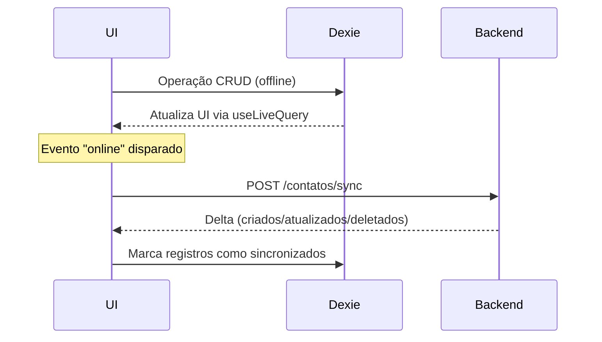

# 📞 Aciono Você — Frontend (Next.js 16 + React 19)

[]

## Sumário
- [Visão geral](#visão-geral)
- [Arquitetura](#arquitetura)
- [Instalação](#instalação)
- [Scripts disponíveis](#scripts-disponíveis)
- [Estrutura de pastas](#estrutura-de-pastas)
- [Variáveis de ambiente](#variáveis-de-ambiente)
- [Sincronização offline](#sincronização-offline)
- [Design System](#design-system)
- [Docker (produção)](#docker-produção)
- [Performance e otimizações](#performance-e-otimizações)
- [Testes e lint](#testes-e-lint)
- [Troubleshooting](#troubleshooting)
- [CI](#ci)

## Visão geral
Aplicação **Progressive Web App** desenvolvida com **Next.js 16** e **React 19**, responsável pela camada de apresentação da lista telefônica hospitalar. Usa **Dexie.js** para persistência offline em IndexedDB e sincroniza com o backend FastAPI via API REST.

## Arquitetura
```mermaid
flowchart TD
    subgraph NextJS[Next.js App]
        A[pages/ (App Router)] --> B[Components]
        B --> C[Dexie DB]
        C --> D[Service Worker]
    end
    A --> E[API calls to Backend]
    D -->|Cache assets| F[(Browser Cache)]
```

## Instalação
| Pré‑requisito | Versão |
|---|---|
| Node.js | 20.0.0+ |
| npm | 10.0.0+ |

```bash
# No PowerShell (raiz do projeto)
npm install
# Desenvolvimento com hot‑reload (porta 8086)
npm run dev
```
Acesse **http://localhost:8086** no navegador.

## Scripts disponíveis
| Script | Descrição |
|---|---|
| `npm run dev` | Servidor de desenvolvimento com hot‑reload |
| `npm run build` | Build otimizado para produção |
| `npm run start` | Executa build estático (produzido por `npm run build`) |
| `npm run lint` | Executa ESLint |
| `npm run type-check` | Verifica tipos TypeScript |

## Estrutura de pastas
```
frontend/
├─ public/                # Manifest, service worker, ícones
├─ src/
│  ├─ app/               # page.tsx (SPA), layout.tsx, globals.css
│  └─ db/                # Dexie schema (db.ts)
├─ next.config.ts        # Configurações Next.js
├─ tsconfig.json         # TypeScript
├─ package.json          # Dependências e scripts
└─ README.md             # Este documento
```

## Variáveis de ambiente
Crie o arquivo **.env.local** na raiz:
```env
NEXT_PUBLIC_API_URL=http://localhost:8085/api   # URL do backend
NEXT_PUBLIC_DEBUG=true                        # Habilita logs no dev
```
Variáveis com prefixo `NEXT_PUBLIC_` são expostas ao cliente.

## Sincronização offline
Fluxo de sincronização (last‑write‑wins):


## Design System
Cores definidas em `globals.css`:
```css
:root {
  --hc-primary: #0066cc;   /* Azul HCFMB */
  --hc-secondary: #6c757d;
  --hc-success: #28a745;
  --hc-danger: #dc3545;
  --hc-warning: #ffc107;
  --hc-info: #17a2b8;
  --spacing-xs: 0.5rem;
  --spacing-sm: 1rem;
  --spacing-md: 1.5rem;
  --spacing-lg: 2rem;
  --font-sans: -apple-system, BlinkMacSystemFont, 'Segoe UI', Roboto, sans-serif;
  --border-radius: 0.375rem;
  --shadow: 0 1px 3px rgba(0,0,0,0.12);
}
```
Componentes reutilizáveis (ex.: `Button`, `Card`) estão localizados em `src/components/`.

## Docker (produção)
Multi‑stage build:
```dockerfile
# Builder
FROM node:20-alpine AS builder
WORKDIR /app
COPY package*.json ./
RUN npm ci --only=production
COPY . .
RUN npm run build

# Runtime
FROM node:20-alpine
WORKDIR /app
COPY --from=builder /app/.next ./.next
COPY --from=builder /app/public ./public
COPY --from=builder /app/node_modules ./node_modules
COPY --from=builder /app/package.json ./package.json
EXPOSE 3000
CMD ["npm", "run", "start"]
```
Execute via Docker Compose (raiz do projeto):
```bash
docker compose up -d --build frontend
```

## Performance e otimizações
- **Image Optimization** automática do Next.js (WebP, lazy‑load). 
- **Code Splitting** por rotas e importação dinâmica.
- **Font Optimization** via `next/font`.
- **Service Worker** cache de assets (1 h) e API‑cache (1 h).
- **IndexedDB** índices para consultas rápidas (> 100 k contatos).

## Testes e lint
```bash
npm run lint            # ESLint
npm run type-check      # Verificação de tipos
npm run test            # (se houver testes configurados)
```

## Troubleshooting
- **EACCES: permission denied** – Execute `npm cache clean --force` e reinstale dependências.
- **Cannot find module '@/db'** – Verifique alias em `tsconfig.json` (`"@/*": ["src/*"]`).
- **Service Worker não registra** – Abra Chrome DevTools → Application → Service Workers e garanta que o status seja "activated and running".
- **NEXT_PUBLIC_API_URL not defined** – Crie ou atualize `.env.local` com a URL correta.

## CI
A pipeline CI está configurada (ex.: GitHub Actions) mas está desatualizada. Possível atualização posterior.
