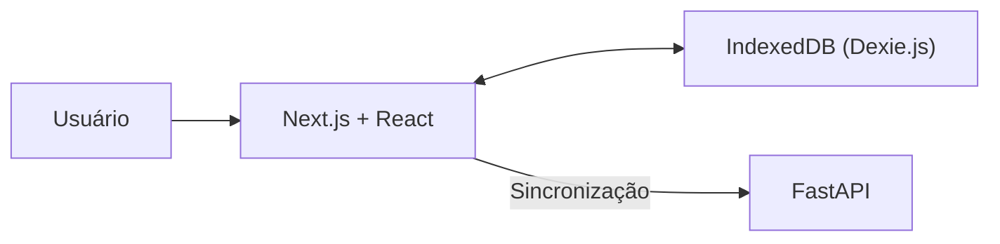

# Frontend Web (PWA)

> Progressive Web Application (PWA) desenvolvida em **Next.js** e **React**, responsável pela interface do usuário, funcionamento offline e sincronização automática de dados do sistema **Aciono Você**.


---

# Visão Geral

O frontend do **Aciono Você** foi desenvolvido como uma **Progressive Web Application (PWA)**, permitindo que profissionais da instituição utilizem o sistema mesmo em ambientes sem conexão com a internet.

A aplicação utiliza o **IndexedDB**, através da biblioteca **Dexie.js**, para armazenar dados localmente, possibilitando consultas e alterações offline.

Quando a conectividade é restabelecida, todas as alterações pendentes são sincronizadas automaticamente com o backend.

---

# Principais Funcionalidades

- Consulta de contatos e ramais.
- Funcionamento Offline (Offline First).
- Progressive Web Application (PWA).
- Instalação em dispositivos móveis e desktops.
- Armazenamento local utilizando IndexedDB.
- Sincronização automática dos dados.
- Atualização em tempo real através de Live Queries.
- Controle de acesso baseado em permissões.
- Interface responsiva.

---

# Arquitetura



O frontend mantém uma cópia local dos dados utilizando o IndexedDB.

As operações realizadas enquanto o dispositivo está offline permanecem armazenadas localmente até que a conexão seja restabelecida.

---

# Tecnologias

| Categoria | Tecnologias |
|------------|-------------|
| Framework | Next.js 16 |
| Biblioteca | React 19 |
| Linguagem | TypeScript 5 |
| Banco Local | IndexedDB |
| Wrapper IndexedDB | Dexie.js |
| PWA | next-pwa |
| Estilização | CSS Modules |
| Ícones | Lucide React |

---

# Estrutura do Projeto

```text
frontend/

├── app/
├── components/
├── hooks/
├── lib/
├── public/
├── styles/
├── package.json
└── README.md
```

A estrutura segue o padrão do App Router do Next.js, separando componentes, páginas, hooks e bibliotecas auxiliares.

---

# Funcionamento Offline

Um dos principais objetivos do projeto é permitir o uso da aplicação mesmo em locais com conectividade limitada.

Quando o usuário está offline:

- consultas continuam funcionando;
- novos contatos podem ser cadastrados;
- alterações permanecem armazenadas localmente;
- exclusões são registradas para sincronização futura.

Ao recuperar conexão, a sincronização ocorre automaticamente com o backend.

---

# Sincronização

O processo de sincronização ocorre de forma transparente para o usuário.

Fluxo simplificado:

```text
Usuário

↓

IndexedDB

↓

Fila de alterações

↓

Backend

↓

PostgreSQL
```

A API é responsável por validar as alterações e resolver possíveis conflitos utilizando a estratégia **Last Write Wins**.

---

# Progressive Web Application (PWA)

A aplicação pode ser instalada como um aplicativo nativo em dispositivos compatíveis.

Entre os recursos suportados estão:

- Manifest Web App.
- Service Worker.
- Cache de arquivos estáticos.
- Funcionamento offline.
- Instalação pelo navegador.

---

# Executando com Docker

Na raiz do projeto execute:

```bash
docker-compose up -d --build
```

O frontend ficará disponível em:

```
http://localhost:8086
```

---

# Executando Localmente

Entre na pasta do frontend:

```bash
cd frontend
```

Instale as dependências:

```bash
npm install
```

Inicie o servidor de desenvolvimento:

```bash
npm run dev
```

A aplicação será iniciada em:

```
http://localhost:8086
```

---

# Build de Produção

Para gerar a versão otimizada da aplicação:

```bash
npm run build
```

Para iniciar a versão de produção:

```bash
npm run start
```

---

# Qualidade do Código

Para verificar problemas de lint:

```bash
npm run lint
```

A build utilizada pela pipeline também valida o projeto através de:

```bash
npm run build
```

---

# Comunicação com o Backend

O frontend consome exclusivamente a API REST disponibilizada pelo backend.

Entre as principais funcionalidades utilizadas estão:

- autenticação;
- gerenciamento de contatos;
- sincronização;
- usuários;
- auditoria.

A documentação completa da API está disponível através do Swagger.

---

# Desenvolvimento

Fluxo recomendado:

1. Criar uma branch.
2. Implementar a funcionalidade.
3. Executar lint.
4. Validar a build.
5. Commit.
6. Push.
7. Abrir Pull Request.

---

# Integração Contínua

O frontend participa da pipeline do GitHub Actions.

Durante cada Push ou Pull Request são executados:

- instalação das dependências;
- lint;
- build de produção;
- build Docker;
- validação da aplicação.

Caso qualquer etapa falhe, a pipeline é interrompida.

---

# Documentação Relacionada

- README principal → `../README.md`
- Backend → `../backend/README.md`